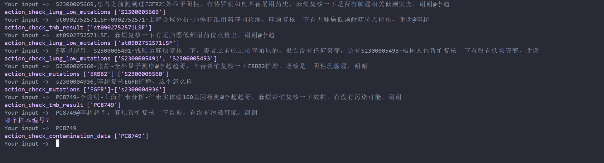

## 1 复核突变
- 突变过多 

```js
st1217374899GMF@李超 超哥，这个PIK3CA突变过多，麻烦复核下数据，谢谢
```
- 突变异常 非常见突变位点
```js
S2300005560-张静-全外显子测序@李超 超哥，辛苦帮忙复核一下ERBB2扩增，送检是三阴性乳腺癌，谢谢
S2300004955-韩良宇-RNA融合基因检测套餐@李超 超哥帮忙复核一下有没有USP6-MYH9融合，谢谢
```
- 突变异常 非常见突变位点（肺癌热点突变）
```js
PD0354-王兔良-上海宏序分析-漠柏实体瘤680基因检测@李超 超哥，麻烦帮忙复核一下数据，胰腺神经内分泌癌查出EGFR热点突变，谢谢
SPMYX23022608CYQQP-陈玉清-上海优甲医疗科技有限公司-优甲胆系肿瘤66基因检测@李超 超哥，辛苦复核一下数据，胆管癌查到肺癌热点突变，谢谢
NBCYX23022706CZSQP-车占双-上海优甲医疗科技有限公司-优甲实体瘤410基因检测@李超 超哥，帮忙复核一下数据，阑尾癌查出肺癌热点突变，谢谢
```
- 突变过少 有无低频耐药突变
```js
st1807559413LSF-1807559413-上海金域分析-肺癌精准用药基因检测，培美曲塞和奈达铂用药史，麻烦复核一下是否有低频耐药突变，谢谢@李超 
@李超 超哥，S2300005491-钱顺运麻烦复核一下，患者之前吃过帕唑帕尼的，报告没有任何突变，还有S2300005493-杨树人也帮忙复核一下有没有低频突变，谢谢
S2300005535-操汪林-核心用药基因检测（48基因）,患者有奥西替尼用药史，麻烦复核一下是否有肺腺癌低频耐药突变，谢谢@李超 
```

## 2 复核MSI
```js
SPMYX23022014ZCMCF-张春梅-上海优甲医疗科技有限公司-优甲实体瘤150基因检测，肺癌MSI-H，李老师麻烦复核下@李超 
S2300005017-石侠-子宫内膜癌分型评估套餐（加强版，25基因），麻烦复核一下MSI，谢谢@李超 
```
## 3 复核TMB
```js
BCDZL9303NBCT4G0202-周丽-上海融享生物科技有限公司-融享671基因检测V3，卵巢透明细胞癌，TMB-H，MSI-H，李老师麻烦复核下，谢谢@李超 
PD1132-樊罗恒-上海仁未分析-仁未707基因检测套餐@李超 超哥，帮忙看下体细胞8个突变加一个BIM杂合变异，TMB怎么是7.1，谢谢
@李超 优甲：NBCYX23022407WZYZZ-吴哲英，麻烦帮忙复核一下结果没有问题（TMB50多，MSI-H），谢谢
```
## 4 复核污染
```js
WZWSJ9619NBCT4G0224-王顺举-上海融享生物科技有限公司-融享671基因检测V3DZ,麻烦复核一下数据是否有污染，谢谢@李超 
SPMYX23030103SYLLJ-孙宜龙-上海优甲医疗科技有限公司-优甲实体瘤150基因检测@李超 超哥，辛苦这个也帮忙复核一下数据，有没有污染可能，谢谢
```

// Check Mutations
action_check_mutations();
action_check_more_mutations();

// Check Lung Mutations
action_check_lung_low_mutations();
action_check_lung_hot_mutations();

// Check Contamination Data
action_check_contamination_data();

// Check MSI Results
action_check_msi_result();

// Check TMB Results
action_check_tmb_result();

## 5 综合展示

